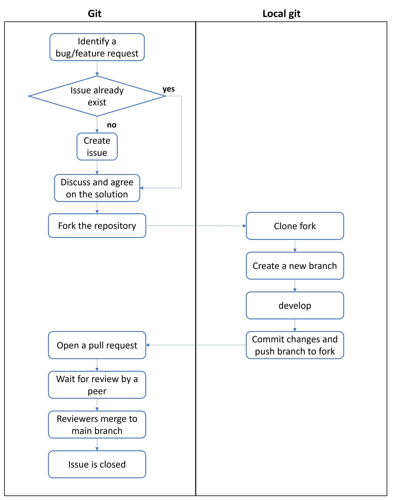

# **How to contribute**
Thank you for your interest in contributing! 
This project welcomes contributions from everyone. Please follow the rules below to help us maintain quality and organization.


---
## **Reporting an issue**

Issues are used to track bugs, missing information, questions, and new ideas that help improve this project.
You should open an issue when you:

- Find a bug or unexpected behavior [bug]

- Notice missing or unclear documentation [doc]

- Need help: ask for assistance or usage guidance [Help]

- Have a new idea or feature suggestion [Feature]


To create a new issue, please follow these steps:
1. Make sure to:
   1. Search existing issues ([Issues page](https://github.com/pyRES-project/pyRES/issues)) to see if the problem or suggestion has already been reported. If it exists, you can comment there instead of opening a duplicate.

   2. Check the documentation or README to ensure the problem isn’t already explained.

   3. Prepare clear information that helps others understand your issue.


If none of the existing issues match your case:

2. Go to the Issues page ([Issues page](https://github.com/pyRES-project/pyRES/issues))
    1. Click “New Issue”. 
    2. Choose the most appropriate type (bug, Doc, Help, Feature)
    3. Write a clear and descriptive title. In the description, include: what you expected to happen, what actually happened,steps to reproduce (if applicable), any screenshots or error messages.

---
## **Good issue example**

### **Title**: 
[bug] Some empty figures open and block code execution

### **Description**:
When I try to run the Tutorial_REC1.ipynb, I get the following error:
TypeError: unsupported operand type(s)

### **Steps to reproduce**:

1. Run Tutorial_REC1.ipynb

2. Observe the error

### **Expected behavior**: 
simulation should complete successfully.

---
## **Contributing via Fork and Pull Request**

Open a fork and submit a pull request if you want to:

- Fix a bug  
- Add a new feature or improvement  

To open a fork and create a pull request, please follow these steps:



1. Identify a bug or a new feature
2. Open an issue first to describe the bug or feature. (check if issue already exists)

3. Discuss the issue with maintainers and other contributors if needed. Once the issue is approved, create a Pull Request to implement your changes.  

4. Fork the repository to your GitHub account.  

5. Clone your fork locally:
   ```bash
   git clone https://github.com/<your-username>/pyRES.git
   cd pyRESeconomics
   
6. Set the original repo as upstream:
   ```
   git remote add upstream https://github.com/pyRES-project/pyRES.git
   git fetch upstream
   git checkout main
   git merge upstream/main

7. Create a new branch for your changes:
   ```
   git checkout -b feature/your-branch-name

8. Make your changes locally.

9. Commit your changes:
   ```
   git add .
   git commit -m "Clear description of the changes"


8. Push your branch to your fork:
   ```
   git push origin feature/your-branch-name


9. Open a Pull Request on the original repository and link the PR to the corresponding issue using a keyword.
   ```
   gh pr create --base main --head yuor-username:main --title "Title of PR" --body "Description of changes. Closes #issue-number"
   ```

10. Wait for reviewers. To follow the status of your Pull Request, you can use the GitHub CLI:

   ```
   gh pr list
   gh pr status
   gh pr view <numero-o-URL>
   gh pr list --state all
   
**Important:** 
- Every Pull Request must **start with an issue**.  
- Always **link the Pull Request to the corresponding issue** using keywords e.g. `Bug #12`, `Feature #10`.  
- Pull Requests without a linked issue will **not be accepted**.