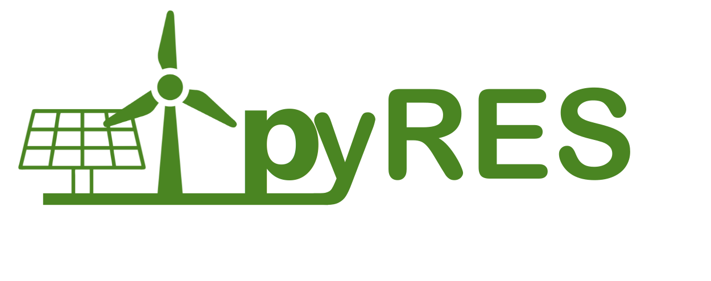
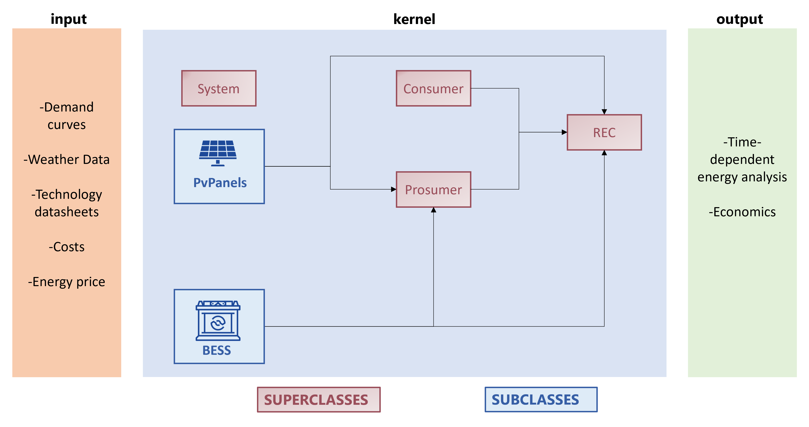
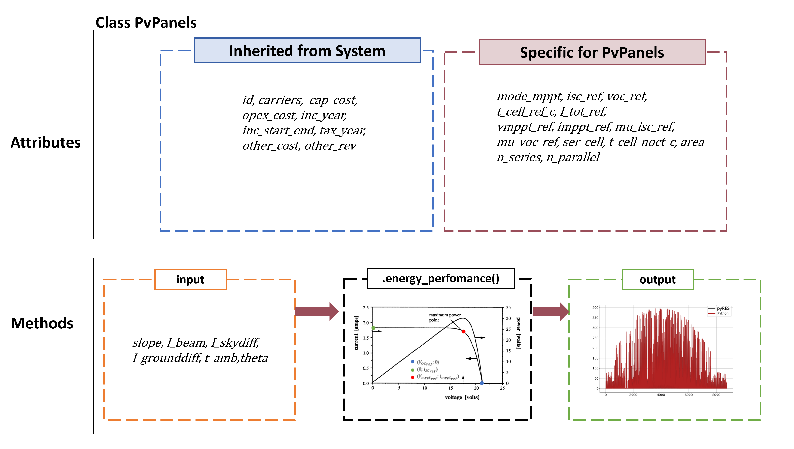
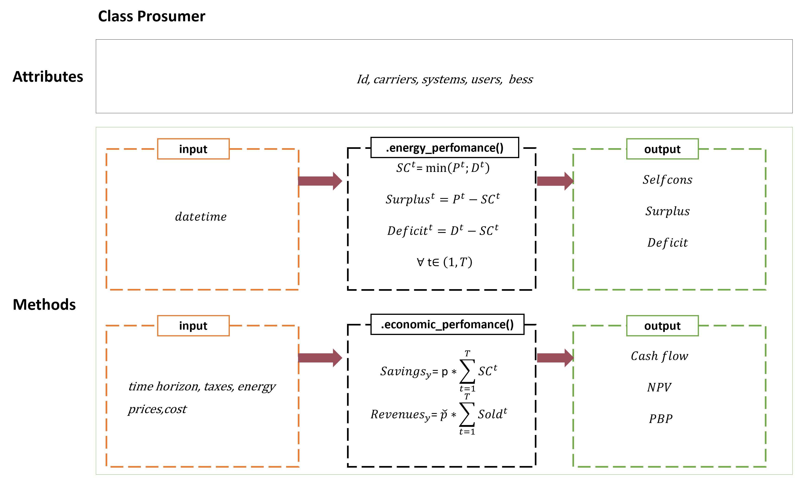
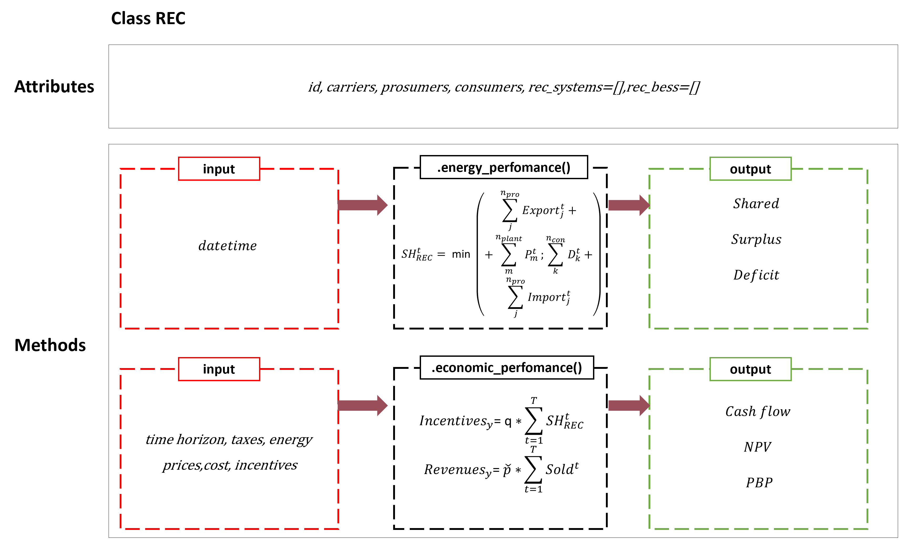
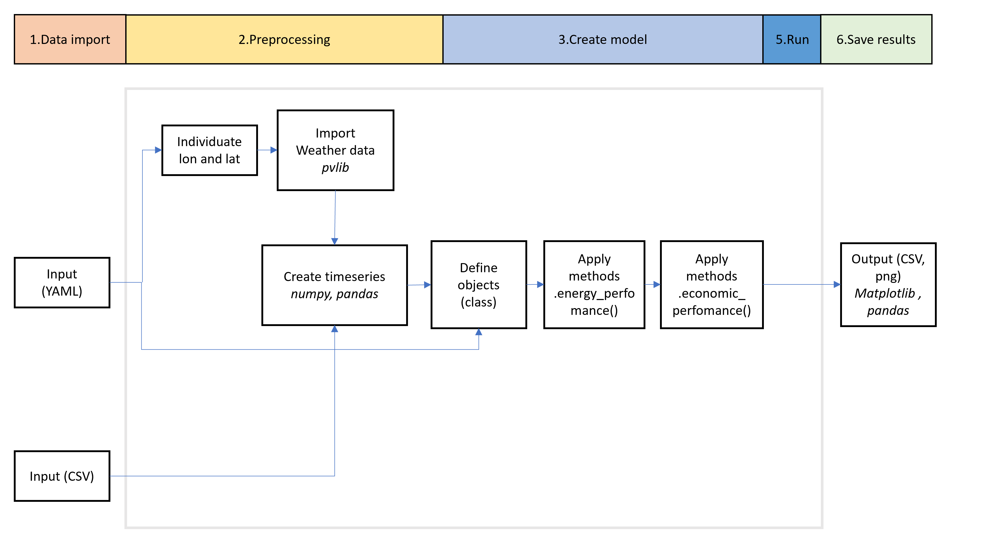

---

# About

This repository contains a simulation tool for supporting the **time-dependent energy analysis** and assessing 
the **economic performance** of renewable energy communities (RECs) composed of consumers and prosumers equipped with 
photovoltaic (PV) systems and battery energy storage systems (BESS). 
pyRES simulates the energy flows and the economic performance. Main outputs include: 
- **Energy flows**: production, self-consumption, surplus, unmet, shared energy for prosumers and community level.
- **Economic items**: CAPEX, OPEX, savings from self-consumption,revenues from exported energy and incentives.
- **Financial indicators**: Payback Period (PBP) and Net Present Value (NPV)

---
## Requirements
In requirements.txt all the required libraries are listed. The main dependencies include:
- numpy
- pandas
-  pvlib
- matplotlib
- pyyaml
- numpy-financial

For the complete list, please refer to requirements.txt file.

---
# Getting Started

1. As a first step, clone the repository using `git clone` or by `downloading the folder`.
2. Then, select the folder you want to create the virtual environment in, right click and open the terminal. Create a virtual environment (in this case named `venv_test`) by running this code: `python -m venv venv_test`
3. Now activate it: select the new venv from the interpreter options (typically on the bottom-right of the interface).
4. Now install libraries from file: `pip install -r requirements.txt`
5. The virtual environment is ready for use.
6. To check the script runs correctly, open the tutorial notebook (`Tutorial_REC1.ipynb file`) and run cell by cell. Remember also to install the JupyterNotebook package. If the code does not run smoothly, address the warnings.
7. Once this step is done, the code and inputs are ready for manipulation!

---

## Repository Structure

- `docs/`:  contains visual resources (e.g., flow charts, plots, and figures) used in the project documentation or README and Default datasheet of PvPanels Class.

- `src/kernel/`: core scripts for managing simulation execution and visualizing results.

   - `run.py`: main engine for initializing and running simulations.

   - `plot_result.py`: functions for visualizing and exporting simulation outputs.

- `src/rec_sim/`: core package containing all simulation logic and model components.

    - `prosumer.py`: defines the Prosumer class, representing a user that both produce and consume energy.
    
    - `consumer.py`: defines the Consumer class, modeling  energy consumers.
    
    - `rec.py`: manages the Renewable Energy Community entity and its internal interactions.
    
    - `system.py`: defines the main System class that coordinates all components in the simulation.
    
    - `battery.py`: models the storage system 
    
    - `controller.py`: includes operational logic for storage system.

- `src/example_model/`: contains example simulations and configuration templates to reproduce test cases.
    - `Rec1/`:  a complete working example that demonstrates how to configure and run a simulation.
 
    - **config.py**:  Python script to generate the config.yaml file with all key parameters and paths for the simulation;read by main.py.
    - **main.py**: main execution script that reads config.yaml and runs the simulation using the modules from rec_sim and kernel.
    - **input/**: directory for input files required by the example (e.g., consumption profiles, PV data).
    - **output/**: directory where simulation results and plots are stored.
    - **Rec1.xlsx**: Excel file summarizing key input parameters.

- `README.md`: project overview, usage instructions, and documentation links.

- `requirements.txt`: list of Python dependencies needed to run the project.

---

# Key Functionalities 
pyRES key functionalities include:
- **Photovoltaic production simulator**: integrates the PVlib library to import meteorological data and then applies a 
PV mathematical model to estimate energy production under varying environmental conditions.

- **Battery Energy Storage System (BESS) simulator**: models battery charging and discharging based on photovoltaic 
production and user consumption.

- **Prosumer simulator**:  manages energy flows, self-consumption, surplus production, and interactions with the grid 
for each prosumer. A prosumer is defined as a user who both consume and produce energy. It also evaluates the 
prosumer's economic perfomance, including savings from self-consumption and revenues from exported energy.

- **Renewable Energy Community simulator**:manages energy flows, shared energy, surplus production, and interactions with the grid 
at the REC level. A REC is defined as a group of prosumers, consumers and renewable energy 
generation systems. It also evaluates the economic performance of the community, including aggregated savings from 
self-consumption, revenues from exported energy and incentives.

# Structure and Classes
pyRES is based on an object-oriented approach, where the superclass System defines common attributes and methods for 
all energy systems. Specific technologies are implemented as subclasses that inherit from the superclass System and 
extend its functionality.This structure allows for easy extension: new energy systems can be added by creating 
additional subclasses, each implementing their specific models.

  

## 1. System Class

The System class represents an energy system (for example, a power plant or an auxiliary component) with the aim to 
collect all its economic items. The constructor initializes attributes related to the system ID, energy carriers, 
capacity, investment and operating costs, incentives, taxes, and other associated costs or revenues.

## 2. PvPanels Class
The PvPanels class models the electrical performance of a photovoltaic array. It is based on the four-parameter 
equivalent circuit model (ILref, I0ref, gamma, Rs),  developed by Townsend and expanded by Duffie and Beckman. 
This empirical model predicts the current-voltage characteristics of a single PV module and extrapolates its performance 
to multi-module arrays using manufacturer data.  The PvPanels class inherits general technical and 
economic attributes from System Class, while adding PV-specific parameters including reference short-circuit current 
(isc_ref), open-circuit voltage (voc_ref), maximum power point voltage and current (vmppt_ref, imppt_ref), 
temperature coefficients, module area, number of cells per module, and configuration in series and parallel.

Main methods allow to:
- Calculate the series resistance of the module using the bisection method.
- Estimate the total incident radiation on the panel, considering geometry and direct/diffuse components.
- Calculate current, voltage, maximum power, cell temperature according to environmental conditions.
- Calculate the fill factor and system efficiency.
- Return the evolution of energy production over time

  

## 3. Bess Class and Controller 
The BESS class models battery charging and discharging based on photovoltaic production and user consumption. 
The class inherits general technical and economic attributes from System Class, while adding BESS-specific 
parameters including conversion efficiency, capacity limits, maximum charge/discharge power, and losses.

The Controller class  manages a production system equipped with one or more battery energy storage systems.
It receives a list of battery objects and evaluates how energy is stored or supplied based on production and demand data over time. 
For each time step, the controller calculates whether there is a surplus (excess energy stored in the batteries) or 
a deficit (energy supplied from the batteries).

## 4. Consumer Class
The Consumer class models a demand profile.

## 5. Prosumer Class
The Prosumer class models a prosumer that include  consumers, energy production systems, and battery storage. 

Main methods allow to:
- calculates the energy flows at the prosumer level including self-consumption (SC), surplus,unmet demand, and manages 
battery storage if present.
- calculate the economic performance of the prosumer over a given time horizon, including savings in energy bills,revenues from exported energy and financial indicators (Payback Period (PBP) and Net Present Value (NPV)). Savings and revenues depend on the energy price to buy (p) and to sell ($\tilde{p}$).

Self-consumption (SC) is calculated as the minimum between production and demand in each time step. 
If BESS is present, self-consumption includes the energy stored in the BESS.

  

## 6. Rec Class
The Rec class models a community that includes prosumers, consumers, energy production systems, and battery storage. 

Main methods allow to:
- calculate the total number of members, prosumers, and consumers.
- calculates the energy flows at the community level, including production, consumption, surplus, shared energy (SH), 
unmet demand, and manages battery storage if present.
- calculate the economic performance of the REC over a given time horizon, including incentives for shared energy and  
financial indicators (Payback Period (PBP) and Net Present Value (NPV)). Incentives depend on the incentive rate for shared energy (q).

Shared energy (SH), is defined at each time step as the minimum between net energy production (total energy generated  minus prosumer self-consumption) and net energy demand (total demand minus prosumer self-consumption). 
When a BESS is present, SH also includes the energy stored in the BESS. 

  

## 7. Economics Class
The Economics class models the economic performance of an energy system over a specified time horizon. It takes as input a 
list of system components (e.g., production systems or batteries) and a dictionary describing annual energy flows 
(sold, self-consumed, purchased) and their corresponding prices and decay rates. 

The main method allow to:

-calculates cash inflows (revenues from energy sales, savings, incentives, and other income) and outflows 
(capital expenditures, operational costs, resource purchases, and taxes). 

-calculates the economic indicators including Net Present Value (NPV) and Pay Back Period (PBP)

---

# Internal implementation

  

pyRES operates through six main stages — from importing data to generating results. 

**1. Data import:The tool begins by reading input data from configuration and data files**:

   - YAML files provide  geographic coordinates (lon, lat) amd  model parameters.

   - CSV files provide time-series data.

**2. Preprocessing**

The tool identifies the location (lon, lat) from the YAML file, then imports weather data using the pvlib library.
Time-series data are organized using numpy and pandas.

**3. Create model**

The tool defines objects (as Python classes) that represent the system components (e.g., energy systems, consumers,
prosumers, or Rec).

**4. Run** 

Two main computational methods are applied:

   - `.energy_performance()` to calculate energy output.
    
   - `.economic_performance()` to evaluate financial indicators (e.g., cost-benefit, payback time).

**5. Save results**

Results are exported using pandas and Matplotlib as:

   - CSV files provide  time-dependent energy evolution and economic perfomance of each prosumer and Rec.

   - png files provide visualization of energy perfomance
---

# Attributions

## Pvlib 

This project makes use of the [pvlib](https://github.com/pvlib/pvlib-python) library, which is licensed under the BSD 3-Clause License.

Copyright © 2013-2024, pvlib developers.

Redistribution and use in source and binary forms, with or without modification, are permitted provided that the following conditions are met:

1. Redistributions of source code must retain the above copyright notice, this list of conditions and the following disclaimer.
2. Redistributions in binary form must reproduce the above copyright notice, this list of conditions and the following disclaimer in the documentation and/or other materials provided with the distribution.
3. Neither the name of the pvlib organization nor the names of its contributors may be used to endorse or promote products derived from this software without specific prior written permission.

## Icons 

Some icons used in this project are designed by The Noun Project and are licensed under CC BY 3.0 / Creative Commons Attribution.

---

# How to cite pyRES

If you use pyRES in a published work, please cite:

- [Corsini, Alessandro, et al. "Challenges of renewable energy communities on small Mediterranean islands: A case study on Ponza island." Renewable Energy 215 (2023): 118986.](https://doi.org/10.1016/j.ecmx.2024.100696)

- [Pizzuti, Isabella, et al. "Integration of photovoltaic panels and biomass-fuelled CHP in an Italian renewable energy community." Energy Conversion and Management: X 24 (2024): 100696.](https://doi.org/10.1016/j.ecmx.2024.100696)

# License

BSD 3-ClauseLicense
